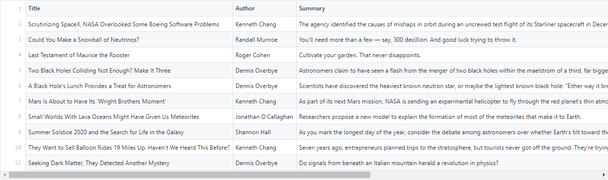

# Web Scraper for NY Times Space and Cosmos Portal
This is a Ruby web scraper that gets info about the latest list of articles from NY Times Space and Cosmos portal. The title, author name, summary and URL for each article are listed.

## Scraped Articles Screenshot

## Built With
- Ruby
- Nokogiri
- RSpec
- Rubocop

## Getting Started
This tool scrapes the first ten articles from the Space and Cosmos page of the New York Times. To get a local copy of the scraper and run it to get the list, follow the steps below.

### Deployment
1. Open your terminal
2. Clone this project running this command in your Terminal: git clone https://github.com/anewman15/nytimes-articles-scrapper.git
3. Run "bundle install" to install all the gems and their dependencies

### Usage
1. Run bin/main.rb in your terminal to start scraping the portal.
3. For each article being successfully you will get the following message printed in your terminal: 
"Making sure data is being scrapped..."
4. If the website is not reachable, an error message will be printed in your terminal: 
"Error: [ErrorType]"
5. Once scraping is over, the listed articles will be saved into the article_list.csv file.
6. You can access article_list.csv file and open it in MS Excel or Google Spreadsheet.

## Live Demo
[Repl.it Demo Link](https://repl.it/@anewman15/nytimes-articles-scraper#main.rb).
Cick the "run" button and then check the article_list.csv file to see the list

## Authors
👤 **Abdullah Numan**
- Github: [@anewman15](https://github.com/anewman15)
- Twitter: [@aanuman15](https://twitter.com/aanuman15)
- Linkedin: [aanuman15](https://www.linkedin.com/in/aanuman15/)

## 🤝 Contributing
Contributions, issues and feature requests are welcome!
Feel free to check the [issues page](https://github.com/anewman15/nytimes-articles-scraper/issues).

## Show your support
Give a ⭐️ if you like this project!

## Acknowledgments
- https://microverse.org/
- https://nokogiri.org/
- http://ruby.bastardsbook.com/